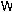
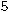

# CTGU_JWC_SCORE

## 写在前面
最近在用`python`做数据挖掘，看到分类算法，手头没有好的练手的例子。就想`KNN`做个图片验证码识别（比较简单的那种，只有字母和数字），顺便爬取一下教务处的个人成绩。

其实之前也爬过教务处的成绩，不过验证码识别使用的是`python`自带的`pytesseract`模块的`image_to_string`方法，识别率有点低，虽然不太满意，但是当时水平有限，没有再做深入。

由于我们教务系统验证码（像这种）太简单了，用`KNN`识别率还可以，经测试，对于这种验证码，识别准确率能达到100%(测试集500组数据，暂时还没出现过识别错误的，毕竟排列太整齐了，而且没有干扰)。

## 验证码处理：
- 预处理
  - 首先将验证码图片转化为黑白图像 </br>
    
  - 分割图像为四部分，转化为对单个字符处理（这里用photoshop看一下各个字符的像素位置）
  - 将单个字符图片转化为0-1矩阵，保存为txt文本，例如 `Y`:
  ```
    11000001100     
    01000001000
    00100010000
    00110110000
    00011100000
    00011000000
    00001000000
    00001000000
    00001000000
    00001000000
    00000000000
  ```
- 训练数据

这部分工作比较无聊，自己做一些训练集，就是每种字符对应的0-1矩阵，每个字符做3、4个就可以了（不嫌多），每个字符就是一个分类标签

- KNN算法

KNN算法，训练过程就是把训练集转化为两个数组，一个数组保存标签，一个保存标签对应的特征，注意保持映射关系），测试就是在训练集中找K个与测试集最接近的点，然后在K个点中进行"投票"，看这K个点中哪个标签出现次数最多，说明测试集的那个点属于这个标签。

- 测试

训练完数据就可以用KNN算法进行测试了。


## 模拟登录

模拟登录是模拟浏览器登陆，因为对于`python`代码发送的请求，如果不加设置，在请求头中没有`User-Agent`属性，那么会被有的网站
认为是攻击请求，会返回 `403`。

对于我们的教务系统，打开`F12`，登录请求时的`header`：

可以直接把那一大串复制过来（去掉Cookie那个字段），然后在用代码发送请求时，添加到请求头中：
```python
reqHeader = {
    "Accept": "text/html,application/xhtml+xml,application/xml;q=0.9,image/webp,image/apng,*/*;q=0.8",
    "Accept-Encoding": "gzip, deflate",
    "Accept-Language": "zh-CN,zh;q=0.9,en;q=0.8",
    "Cache-Control": "no-cache",
    "Connection": "keep-alive",
    "Content-Length": "306",
    "Content-Type": "application/x-www-form-urlencoded",
    "Host": "210.42.38.26:84",
    "Origin": "http://210.42.38.26:84",
    "Pragma": "no-cache",
    "Referer": "http://210.42.38.26:84/jwc_glxt/",
    "Upgrade-Insecure-Requests": "1",
    "User-Agent": "Mozilla/5.0 (Windows NT 10.0; Win64; x64) AppleWebKit/537.36 (KHTML, like Gecko) Chrome/69.0.3497.100 Safari/537.36"
}
```
然后再看一下需要提交的表单信息：

同样也添加到我们的登陆请求中：
```python
postData = {
    "__VIEWSTATE": "/wEPDwUKLTQ4NjU1OTA5NGQYAQUeX19Db250cm9sc1JlcXVpcmVQb3N0QmFja0tleV9fFgEFCGJ0bkxvZ2luMRg1SjrafPmtoydz1mPeR4vBlIE=",
    "__EVENTVALIDATION": "/wEWBQK8vuPMAgKl1bKzCQKC3IeGDAK1qbSRCwLO44u1DdFTNDJgcOwlCVJHcDBqwrj3IMXf",
    "txtUserName": sno,  # 学号
    "txtPassword": pwd,  # 密码
    "btnLogin.x": "37",
    "btnLogin.y": "12",
    "CheckCode": ""      # 验证码
}

loginResponse = session.post(loginUrl, data = postData, headers = reqHeader)
```
还有需要注意的是，由于验证码是一个单独的网页，那么最好用session()来发送请求，保证获取验证码和登录是同一次会话，其他的就没什么可说的了

## 版本及模块

- python 3.6
  - Image   用于图片黑白处理和分割
  - requests 发送请求
  - BeautifulSoup  Html页面解析


